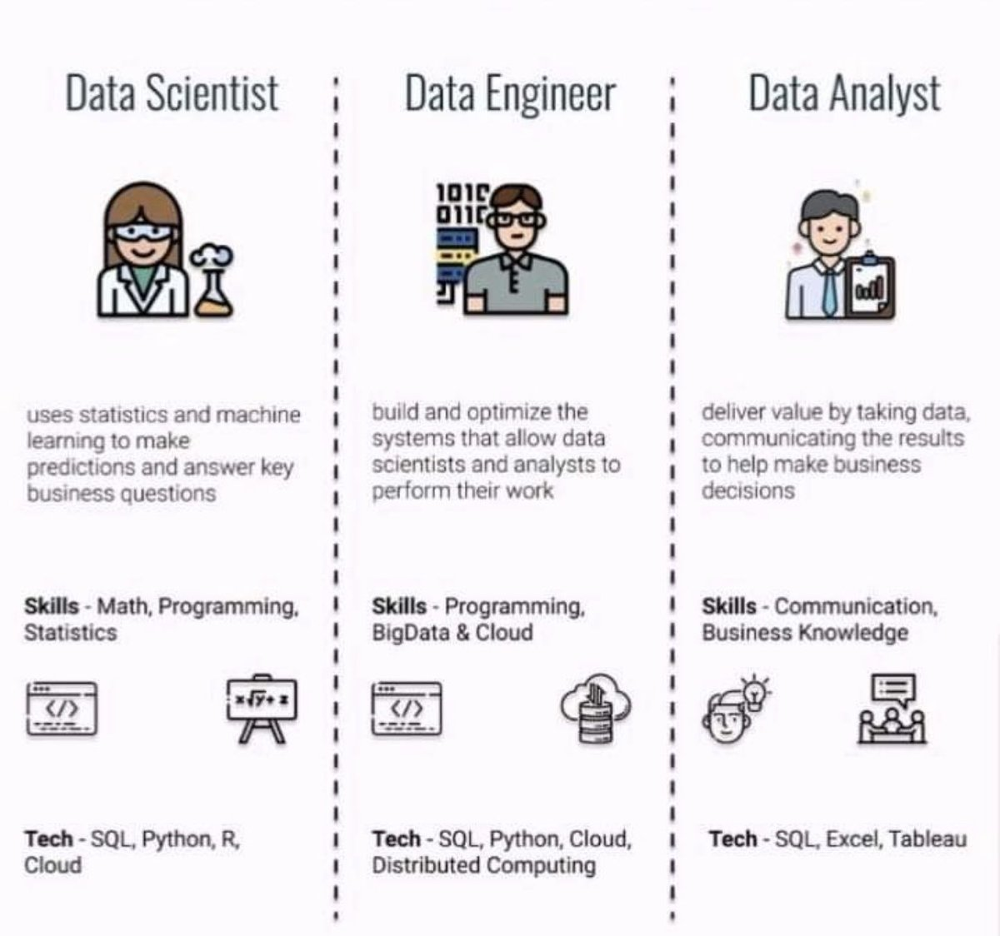

Are Developer Advocates the same as Developers? How do a Project Manager, Program Manager, and Product Manager differ in their roles? How about a UX Designer versus a UI Engineer?

The software industry is growing at an exploding rate and it seems that this is the hottest job market since the dot-com era. While it's a great time to be a candidate; it can be challenging and frustrating to be recruiting for top tech talent in this red-hot market. I'm writing this letter to help you:

1. Clear common misconceptions around some of these roles
2. Learn about how some of these roles are NOT the same 

Are you an expert recruiter who knows this already? That's awesome for you and now you have a handy blog link to share with your colleagues who might need it (you and I both know that a lot of them will need this 😉)

## Why do I care

I've been working as a Developer Advocate since 2019 and I've been getting emails for roles such as:

- Fullstack Developer
- Backend Engineer
- DevOps Engineer

When I shared this with some of my colleagues, I learned that other professionals are also getting approached for roles that they aren't interested in. I realized that very few tech recruiters know the differences between similarly-grouped, yet different roles. 

I treat time as my most precious resource and I believe you do that too. I believe that if you go through this letter, you'll save **time** both for yourself and for the future candidates you reach out to. 

## The list

**Fullstack Developer** 

First of all, a Software Engineer is not the same as a Fullstack Developer/Engineer. A Fullstack Developer is more relevant to web development to mainly differentiate the front-end (the website/app interface) and back-end (the business logic/API/database) work. Imagine the web development work being a spectrum with one end being the front-end, and the other end is the back-end. The most likely scenario is that a candidate will have a preference in one end with a general understanding of the entire spectrum. That's how folks develop depth or specialty in an area. Some folks mastered the breadth and can jump on from a Javascript framework to a SQL or NoSQL database at ease. It is, however, very unlikely that they will have the same depth alongside the breadth.  

Even when we mention "the stack", there can be a zillion different combinations of what that stack is. Your stack can be GoLang/React or Angular/Java or anything in between. And then there are also additional things such as mobile development, embedded, desktop development (for specific operating systems), etc. 

Why do companies want a Fullstack Developer then? From my eight years of experience working in the software industry, here is why:

1. The team/company is too small to hire frontend and backend experts separately. This can be true for both small startups with single-digit employee count or large consulting companies with small/autonomous projects functioning as small startups.
2. The team/company is trying to hire those rare unicorns in the software industry who are true Fullstack Developers with depth in many parts of both the frontend and backend areas. Heads up: the majority of these unicorns end up as Software Architects, Engineering Managers, or CTOs. So the pool of true Fullstack Developers is even smaller. 
3. The unwanted truth: The team/company does not have a clue on why they need five Fullstack Developers rather than hiring two Frontend Developers, two Backend Developers, and one DevOps Engineer. They send out a laundry list as a job description with any and every buzzword they can google: HTML, CSS, Java, JavaScript, Go, Python, NodeJS, React, TDD, BDD, Unit testing, Machine Learning, TensorFlow, GCP, AWS, DevOps, IAM, DevSecOps, Kotlin. 

TL;DR

- If you got a headcount to hire a Software Developer, refer to the above list if the situation matches. If it matches #3, ask questions.
-  If the situation matches #2, are you ready to pay a package that a unicorn deserves?
- If the situation matches #1, your team/company has no choice and you have to find a candidate who is a strong Backend/Frontend Developer showcasing their resume as a Fullstack Developer (or you might get lucky and find one of the unicorns). 

**Developer Advocate**

To the untrained eye, a Developer Advocate might seem like just another Developer. 

⚠️ They are NOT the same ⚠️

Developer advocacy/evangelism is still pretty new so the confusion is understandable. Typically, software companies have two models of structuring their advocacy - either under engineering or under marketing org. The essence is the same. A Developer Advocate works as a two-way feedback mechanism. On one end, they go out there and present the cool technologies the engineering team builds in the form of workshops, blogs, talks, etc. On the other (more important) end, the advocate brings back the +ve/-ve feedback about the product from the customer/community, back to the engineering team.

Can you hire a Developer Advocate for your developer role? You certainly can and you certainly should not. Here's why:

Most (read "all") Developer Advocates were Developers/Architects at some point in their careers. They are well-regarded in the industry as experts whose audience is a group of developers. It's almost impossible to talk technology with another developer if you were/are not a developer at some point in your career. However, developer advocates, out of their passion for building the community and teaching, have transitioned to advocacy from a pure software development role. Although many of them can go back to writing code only, almost none of them will because of their conscious choices to switch to advocacy. This resonates better with their skill set, personality traits, and career aspirations.  

Is developer advocacy similar to marketing?

Let me quote [Angie Jones](https://github.com/readme/guides/angie-jones-demystifying-developer-advocacy) on this point:

> Kind of, but not in the cringey way we typically think of. Developer advocates are engineers, not marketers. In fact, they are trusted engineers with influence. A good developer advocate takes this very seriously and will not betray the community’s trust.

Is developer advocacy similar to technical sales?

**NO**! While sales are key to a company's growth, sales is NEVER a Developer Advocate's responsibility. Developer Advocates talk to external Developers about technology without any pitch about the product. Those external Developers influence their team/stakeholders on the technology first and that might lead to the adoption of your product. 

TL; DR

- If you're reaching out to a Developer Advocate, reach out for developer advocacy or related roles (Community Manager, Developer Advocacy Manager/Director, etc.)
- If you have a developer advocacy role to fill, you can reach out to other Developer Advocates or Senior Software Engineers who regularly produce technical content and/or speak at conferences
- If you're wondering the right salary for a Developer Advocate, some folks have worked really hard to prepare [an exhaustive report](https://dev.to/bffjossy/2021-devrel-salary-survey-results-table-of-contents-43fe) for you

 

**DevOps and SRE**

If you've taken a programming course before, a way to compare DevOps to SRE is **class SRE implements DevOps**. The confusion between these two roles is very understandable as the tools and skills required for these roles highly overlap. From a recruiter's perspective, here is a list of key differentiators between a DevOps Engineer and a Site Reliability Engineer (SRE):

- Being on-call is part of an SRE job but I don't know any DevOps Engineer who regularly needs to be on-call
- Due to that on-call nature of work, SRE salaries are typically higher than many other roles in the software industry
- Many companies integrate a DevOps Engineer within a software team and don't have a team of DevOps Engineers. On the other hand, almost every single company that employs SREs has a team of SREs (unless there is a single SRE in the company)

**Project Manager, Program Manager, and Product Manager**

Let's take a look at the similarities first:

- Work with cross-functional teams
- Exceptional organization skills
- Strategic approach
- Effective communication skills
- Negotiation skills
- Natural leadership
- Empathy

None of these roles are entry-level roles as these are leadership roles and oftentimes, you need authority to perform actions. When you see that some companies offer Project Management internships, they offer a chance to early career professionals to shadow experienced Project Managers to learn from; not to lead an engineering project all by themselves.

Here is a list of differences among these three roles *from a recruiter's perspective*:

- Unlike a Project Manager or a Program Manager, a Product Manager has to know in-depth about their product(s), go to market strategies, and product roadmap
- A Project Manager manages the scope and responsibility for delivery, budget, resource allocation, and quality of a project and these are the key areas you need to focus on when hiring for a Project Manager
- A Program Manager manages a group of related projects in an interconnected way and they can be thought of as experienced Project Managers with a broader scope. Some companies have a different definition of a "program", for example, "developer relations program". In those cases, the program is not comprised of multiple projects; rather a larger, long-term business objective to drives strategic benefits and organizational growth

TL;DR 

Because of the huge overlap in the required skills, you can reach out to a candidate for either a Project Manager or a Program Manager role if their experiences and seniority level match with the job you have to offer. For a Product Manager role, you should find a candidate with deep insights into the product, a strategic vision about the roadmap, and a clear idea on how to go to market. 
 
**UX Designer, UI Engineer, UX Researcher, and related roles**

A UX Researcher’s primary job is to understand the target market so the UX designer can design a product they’ll like. A UI Engineer, in my understanding, is a Frontend Developer who uses the high-fidelity prototypes that UX Designer built to build the interface(s) of the product (websites, app, etc). It's better to avoid the term "UI Engineer" as more commonly understood terms are UX/UI Designers on the design side and Frontend Developers on the engineering side.

**Data Scientist, Data Engineer, and Data Analyst**

If you're hiring for an entry-level person, you're probably looking for a Data Analyst. Common tasks done by data analysts include data cleaning, performing analysis and creating data visualizations. A Data Scientist is a specialist who uses statistics and machine learning to answer key business questions. A Data Engineer builds and optimizes the systems that allow Data Scientists and Data Analysts to perform their work. Unlike the previous two roles, data engineering leans a lot more toward a software development skill set. [This tweet](https://twitter.com/RealSaintSteven/status/1257781619584270337?s=20&t=LEJQUFBgt0JNvNzTfc3xQg) adds a nice visual comparison among these three roles:

---
Thank you for patiently reading my letter. I am really excited to hear your thoughts and possible improvements on this open letter. I hope you write me back and if you do, please do not lead with a job for a Fullstack Developer 🤪

Sincerely,

*Dewan*
 